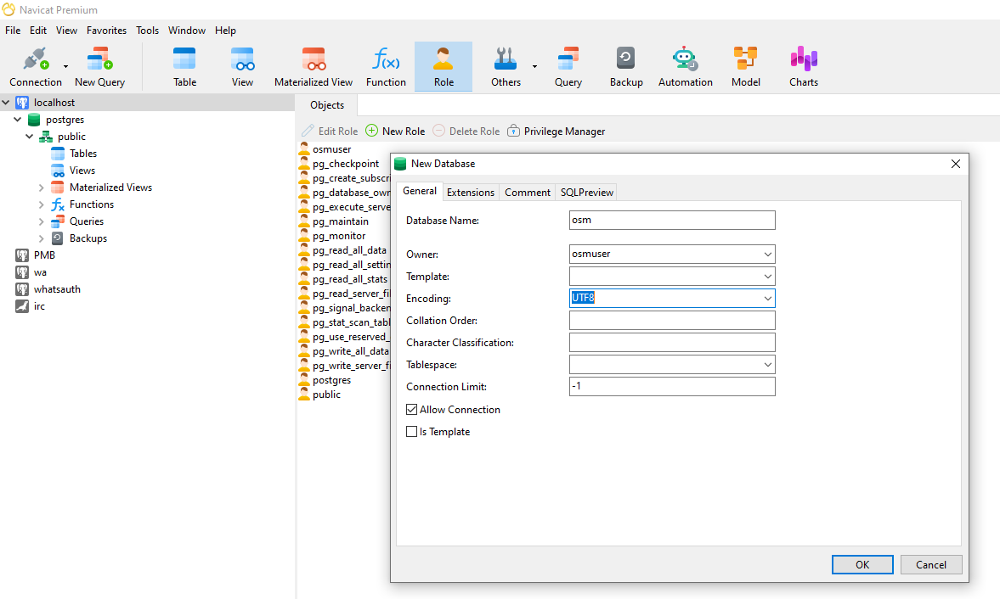

# OpenStreetMap data

Kita akan coba mengunduh dan mencoba sendiri data OpenStreetMap. Untuk mengunduh data OSM per wilayah kita bisa mengunjungi situs [GeoFabrik](https://download.geofabrik.de/). 
Jika ingin mengunduh semua data OSM maka kunjungi web [Planet](https://planet.openstreetmap.org/)

## Cara Mengunduh
1. Download [Data OSM Asia](https://download.geofabrik.de/asia.html) atau [pulau Jawa](https://download.geofabrik.de/asia/indonesia/java.html)
2. Masukkan ke dalam RDBMS PostgreSQL menggunakan [OSM2PGSQL](https://osm2pgsql.org/)
3. Filter data ambil saja data nama jalan wilayah Bandung, Cimahi, KBB, Kab. Bandung
4. Coba buat fungsi nearest jalan di golang dari data jalan
5. Implementasikan menjadi Endpoint

## Persiapan Basis Data
1. Unduh [PostgreSQL](https://www.postgresql.org/download/) dan Plugin [PostGIS](https://www.postgresql.org/download/)
2. Buat Database `osm`, user `osmuser`
3. Enable plugin `postgis` pada database yang baru dibuat
4. Opsional enable juga extension `hstore`
    ```sh
    sudo -u postgres createuser osmuser
    sudo -u postgres createdb --encoding=UTF8 --owner=osmuser osm
    sudo -u postgres psql osm --command='CREATE EXTENSION postgis;'
    sudo -u postgres psql osm --command='CREATE EXTENSION hstore;'
    ```
      
      
    
   Lakukan optimasi setting pada file postgresql.conf
   ```conf
   shared_buffers = 1GB
   work_mem = 50MB
   maintenance_work_mem = 10GB
   autovacuum_work_mem = 2GB
   wal_level = minimal
   checkpoint_timeout = 60min
   max_wal_size = 10GB
   checkpoint_completion_target = 0.9
   max_wal_senders = 0
   random_page_cost = 1.0
   ```
   
6. Unduh dan gunakan [OSM2pgsql](https://osm2pgsql.org/doc/manual.html)  
      
    
    ```sh
    osm2pgsql java-nov24.osm.pbf -d osm -H 127.0.0.1 -U osmuser -W
    ```
      

## Cara query jalan dari poin
To find the nearest road from a specific point using the tables you've imported with `osm2pgsql`, you can use the `planet_osm_roads` table. This table contains road data, which you can use along with a point geometry to calculate the nearest road.

Assuming you have a specific point in the form of coordinates (latitude and longitude), you can use the following SQL query to find the nearest road:

### Steps

1. **Ensure PostGIS Functions Are Enabled**: 
   - Make sure you have the PostGIS extension enabled, as we will use spatial functions from PostGIS.

2. **Query for the Nearest Road**:
   - Here’s a query that finds the nearest road to a given point (let's say you want to find the road closest to the point with coordinates `latitude` and `longitude`).

   ```sql
   WITH point AS (
    SELECT ST_SetSRID(ST_Point(107.5757039885127, -6.8742889139371215), 4326) AS geom  -- Replace with your longitude and latitude
    )
    SELECT 
        r.osm_id,
        r.name,
        r.highway,
        r.way,
        ST_Distance(
            ST_Transform(r.way, 4326)::geography,  -- Transform the way geometry to SRID 4326
            point.geom::geography
        ) AS distance_meters
    FROM 
        planet_osm_roads r,
        point
    ORDER BY 
        ST_Distance(
            ST_Transform(r.way, 4326)::geography,
            point.geom::geography
        ) 
    LIMIT 15;

   ```

   - **Explanation**:
     - `ST_SetSRID(ST_Point(<longitude>, <latitude>), 4326)`: Creates a point geometry from the latitude and longitude in the WGS 84 spatial reference system (SRID 4326).
     - `ST_Distance(r.way::geography, point.geom::geography)`: Calculates the distance between the point and each road, using the `geography` type for accurate distance in meters.
     - `ORDER BY ST_Distance(...)`: Orders the results by distance in ascending order to get the nearest road.
     - `LIMIT 1`: Limits the result to only the nearest road.

### Hasil


