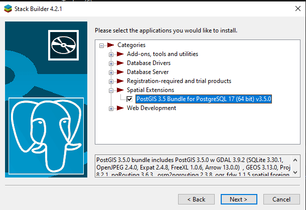

# OpenStreetMap data

Kita akan coba mengunduh dan mencoba sendiri data OpenStreetMap. Untuk mengunduh data OSM per wilayah kita bisa mengunjungi situs [GeoFabrik](https://download.geofabrik.de/). 
Jika ingin mengunduh semua data OSM maka kunjungi web [Planet](https://planet.openstreetmap.org/)

## Cara Mengunduh
1. Download [Data OSM Asia](https://download.geofabrik.de/asia.html) atau [pulau Jawa](https://download.geofabrik.de/asia/indonesia/java.html)
2. Masukkan ke dalam RDBMS PostgreSQL menggunakan [OSM2PGSQL](https://osm2pgsql.org/)
3. Filter data ambil saja data nama jalan wilayah Bandung, Cimahi, KBB, Kab. Bandung
4. Coba buat fungsi nearest jalan di golang dari data jalan
5. Implementasikan menjadi Endpoint

## Persiapan Basis Data
1. Unduh [PostgreSQL](https://www.postgresql.org/download/) dan Plugin [PostGIS](https://www.postgresql.org/download/)
2. Buat Database `osm`, user `osmuser`
3. Enable plugin `postgis` pada database yang baru dibuat
4. Opsional enable juga extension `hstore`

```sh
sudo -u postgres createuser osmuser
sudo -u postgres createdb --encoding=UTF8 --owner=osmuser osm
sudo -u postgres psql osm --command='CREATE EXTENSION postgis;'
sudo -u postgres psql osm --command='CREATE EXTENSION hstore;'
```
  

  


  


